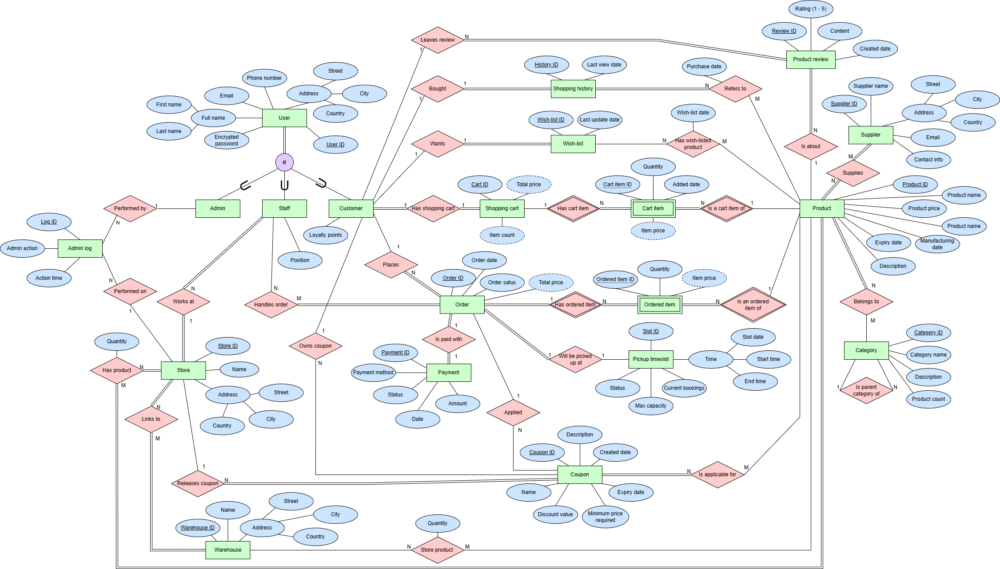
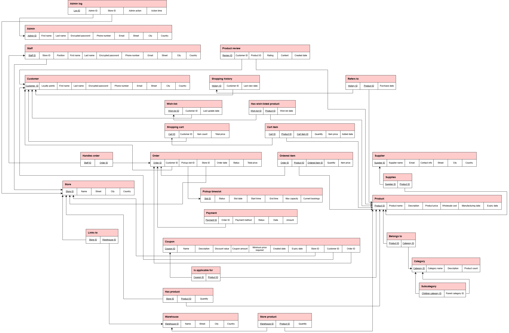
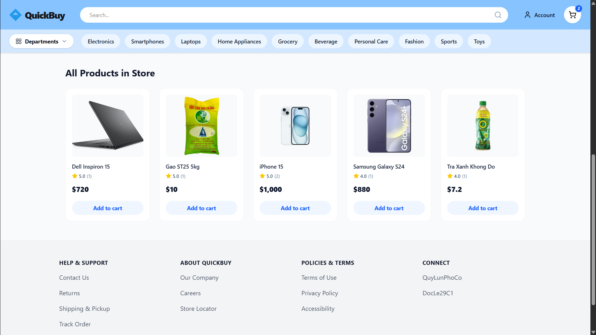

# 🛒 QUICK BUY

In this project, I worked primarily as a **database designer**.

In particular, my role revolved around structuring the **Enhanced Entity-Relationship Diagram (EERD)** and **relational schema** to map e-commerce data
structures.

On top of that, implementing targeted end-to-end functionality to **query**, **sort**, and display the top-rated products for each specific category was a part of my duty during the development cycle. 

## 🪟 Project Overview

QuickBuy, is a business-to-consumer (B2C) e-commerce platform
modeled after Walmart’s retail ecosystem, designed to simulate an online marketplace where customers can browse, purchase, and review a wide range of products. The platform integrates user registration, product search and categorization, shopping cart and wishlist management, secure payment processing, coupon-based discounts, shopping and search history tracking, and warehouse-based order fulfillment to provide a complete digital retail experience.

## 🎯 Project Objectives

The project aims to:
- Develop a reliable system that supports customers and store administrators/staff in online shopping and in-store pickup operations.
  
- Enable product browsing, cart and checkout with payments and promotions, pickup timeslot assignment by staff, and order tracking. 
  
- Design a database which specifies entity types, attributes, relationships, and semantic constraints to ensure an efficient and scalable solution.

## 🧩 Database Design

### Enhanced Entity-Relationship Diagram (EERD)

### Relational Schema

## ⚙️ Sorting Feature

